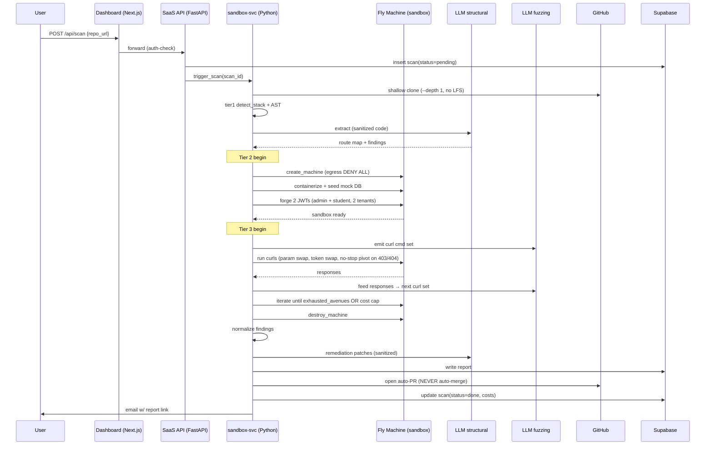

# AntiVibe — Architecture

**Purpose:** High-level system map for AntiVibe SaaS — agentic DevSecOps platform that audits AI-generated ("vibecoded") apps via GitHub URL with 3-tier pipeline (static → sandbox → autonomous fuzzing).
**Last Updated:** 2026-07-04
**Owner:** AntiVibe solo-founder + coding-agent-orchestration (agent-runbook at `docs/agent-orchestration.md`)

## 1-Minute Overview

Developer pastes a GitHub URL OR connects GitHub OAuth → AntiVibe clones repo → runs **Tier 1 static scan** (AST + secrets + config flaws + LLM semantic) → **Tier 2 sandbox spin-up** (Fly.io microVM, mock DBs, JWT forge) → **Tier 3 autonomous fuzz agent** (route walker, BOLA/IDOR tester, no-stop pivot loop) → normalizes findings → generates executive report + auto-PR with remediation patches. Buyer = indie vibe-coder. Deploy = Fly.io.

## Component Inventory

| Component | Responsibility | Tech | Ships in Wave |
|-----------|----------------|------|---------------|
| Next.js Dashboard | User UI: scan submit, finding drilldown, billing | Next.js 14 App Router, Tailwind, shadcn/ui | Wave 5 |
| FastAPI SaaS API | Public REST endpoints (`/api/scan`, webhooks, billing) | Python FastAPI | Wave 5 |
| sandbox-svc | Tier 1+2+3 execution engine | Python (asyncio + httpx + PyFly) | Wave 2-4 |
| Fly Machines | Ephemeral isolated microVMs = sandbox | Fly.io Firecracker-native | Wave 3 |
| Supabase | Postgres + Auth + Storage (scan artifacts) | Supabase combo | Wave 1 |
| LLM dual-model | Structural extractor (Anthropic) + Fuzzing pattern gen (OSS-inference Together/Anyscale) | Hosted inference | Wave 2/4 |
| Stripe / LemonSqueezy | Billing ($19/mo Indie, $49/mo Pro) | Stripe webhook + Supabase | Wave 6 |
| GitHub OAuth App | Private repo access + webhook trigger + auto-PR creation | OAuth App + HMAC-SHA256 webhook | Wave 5 |

## Tier Pipeline Diagram

## Whitelists (locked — see `docs/sandbox-isolation.md` for enforcement)

**App stacks (6):** Next.js, Express, Firebase/Firestore, FastAPI, Flask, SvelteKit.
**Auth-stack forge (5):** NextAuth, Clerk, Firebase Auth, Supabase Auth, custom HS256/RS256.
**DB mock support (2):** Postgres, Firestore.

No mid-sprint additions — Metis scope-creep guardrail.

## Cost + Latency Guardrails (Metis)

- **$0.50/scan max cost** (Fly Machine time + LLM tokens). Circuit-breaker at 10min runtime.
- Latency targets: Tier 1 p95 <5min; Tier 2+3 p95 <15min.
- LLM token usage <100K tokens/scan.
- Fly Machine auto-destroy post-scan.
- Daily spend cap per user.

## Security Guardrails Summary (see `docs/security-threat-model.md`)

- Sandbox egress = DENY ALL except localhost (audit log catches any attempt).
- GitHub webhook = HMAC-SHA256 signature verification mandatory.
- Auto-PR = **NEVER auto-merge** (human review required).
- LLM input sanitization = strip secrets/PII before API call.
- Repo clone = shallow `--depth 1`, no LFS, ≤500MB, block postinstall scripts.

## Tech Stack Summary

- **Frontend**: Next.js 14 App Router + Tailwind + shadcn/ui (deploy to Fly.io)
- **SaaS API**: FastAPI (Python)
- **Sandbox orchestrator**: Python (PyFly + httpx + asyncio)
- **DB + auth + storage**: Supabase Postgres + Auth + Storage
- **LLM**: Anthropic (structural extractor) + Together/Anyscale (OSS fuzzing generator)
- **Deploy target**: Fly.io (Fly Machines = sandbox)
- **Billing**: Stripe or LemonSqueezy (decided in task 38; Lemon Squeezy handles EU VAT = preferable for solo founder)

---

## Status

| Subsystem | Done? | Owner Task | Last Update |
|-----------|-------|-----------|-------------|
| Repo scaffold | pending | 1 | — |
| Supabase schema | pending | 3 | — |
| Fly Machines client | pending | 5 | — |
| Tier 1 static engine | pending | 9-15 | — |
| Tier 2 sandbox | pending | 16-22 | — |
| Tier 3 fuzz agent | pending | 23-29 | — |
| Report + auto-PR | pending | 30-33 | — |
| GitHub OAuth + webhook | pending | 34-35 | — |
| Dashboard UI | pending | 36-37, 44 | — |
| Billing | pending | 38-39 | — |
| E2E integration | pending | 43 | — |
| YC demo | pending | 49 | — |

Plan source: `.omo/plans/antivibe-saas.md` (master plan, 50 tasks, 7 waves).