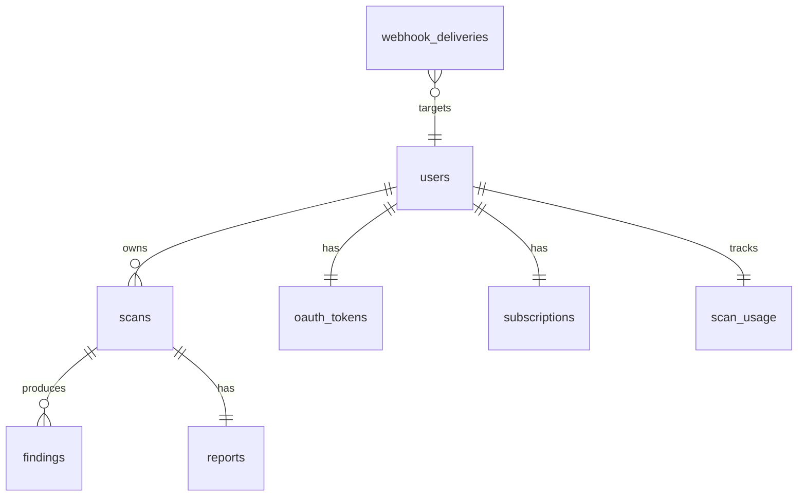

# AntiVibe — Data Model

**Purpose:** Supabase Postgres schema spec — tables, RLS policies, ERD. Implementation source-of-truth for `migrations/0001_init.sql`.
**Last Updated:** 2026-07-04
**Owner:** AntiVibe solo-founder

## ERD



## Table Specs

### `users` (extends `auth.users`)
```sql
create table public.users (
  id uuid primary key references auth.users(id) on delete cascade,
  email text not null,
  email_verified_at timestamptz,
  created_at timestamptz default now(),
  updated_at timestamptz default now()
);
```

### `scans`
```sql
create type scan_status as enum (
  'pending', 'cloning', 'detected', 'tier1_running',
  'tier2_running', 'tier3_running', 'normalizing',
  'done', 'partial', 'failed'
);
create type stack_t as enum ('nextjs','express','firebase','fastapi','flask','sveltekit');
create type auth_stack_t as enum ('nextauth','clerk','firebase','supabase','custom');

create table public.scans (
  id uuid primary key default gen_random_uuid(),
  user_id uuid not null references public.users(id) on delete cascade,
  repo_url text not null,
  branch text,
  stack stack_t,
  auth_stack auth_stack_t,
  status scan_status not null default 'pending',
  stage jsonb not null default '{}'::jsonb,
  started_at timestamptz default now(),
  completed_at timestamptz,
  cost_cents int default 0,
  llm_tokens_in int default 0,
  llm_tokens_out int default 0,
  machine_seconds int default 0,
  error jsonb,
  created_at timestamptz default now(),
  updated_at timestamptz default now()
);
create index on public.scans (user_id, created_at desc);
create index on public.scans (status) where status in ('running','tier1_running','tier2_running','tier3_running');
```

### `findings`
```sql
create type severity_t as enum ('critical','high','medium','low','info');

create table public.findings (
  id uuid primary key default gen_random_uuid(),
  scan_id uuid not null references public.scans(id) on delete cascade,
  severity severity_t not null,
  title text not null,
  description text,
  file_path text,
  line int,
  evidence_curl text,
  remediation_code text,
  tier smallint check (tier in (1,2,3)),
  model_source text check (model_source in ('rule','ast','llm','fuzz')),
  created_at timestamptz default now()
);
create index on public.findings (scan_id);
create index on public.findings (severity);
```

### `reports`
```sql
create table public.reports (
  scan_id uuid primary key references public.scans(id) on delete cascade,
  markdown text not null,
  json jsonb not null,
  artifact_url text,
  created_at timestamptz default now()
);
```

### `oauth_tokens`
```sql
create table public.oauth_tokens (
  user_id uuid primary key references public.users(id) on delete cascade,
  provider text not null check (provider = 'github'),
  access_token_encrypted text not null,
  scope text,
  expires_at timestamptz,
  created_at timestamptz default now(),
  updated_at timestamptz default now()
);
```

### `webhook_deliveries`
```sql
create table public.webhook_deliveries (
  event_id text primary key,
  user_id uuid references public.users(id),
  source text not null check (source in ('github','stripe','lemonsqueezy')),
  signature text,
  payload jsonb not null,
  processed_at timestamptz default now()
);
```

### `subscriptions`
```sql
create type tier_t as enum ('free','indie','pro');

create table public.subscriptions (
  user_id uuid primary key references public.users(id) on delete cascade,
  tier tier_t not null default 'free',
  external_customer_id text,
  external_sub_id text,
  status text check (status in ('trialing','active','canceled','past_due')),
  current_period_end timestamptz,
  created_at timestamptz default now(),
  updated_at timestamptz default now()
);
```

### `scan_usage`
```sql
create table public.scan_usage (
  user_id uuid not null references public.users(id) on delete cascade,
  month_date date not null,
  scans_used int default 0,
  scans_limit int default 1,
  primary key (user_id, month_date)
);
```

## RLS Policy Spec

Every table:
```sql
alter table public.<name> enable row level security;

-- users, scans, oauth_tokens, subscriptions, scan_usage:
create policy "owner_select" on public.<name>
  for select using (auth.uid() = user_id);
create policy "owner_insert" on public.<name>
  for insert with check (auth.uid() = user_id);
create policy "owner_update" on public.<name>
  for update using (auth.uid() = user_id);

-- findings, reports (inheriting scan ownership):
create policy "owner_via_scan" on public.<name>
  for select using (
    exists (
      select 1 from public.scans s
      where s.id = <name>.scan_id and s.user_id = auth.uid()
    )
  );
```

`webhook_deliveries` not user-readable; service-role only.

## Migrations

- `migrations/0001_init.sql` — all tables + RLS (Task 3)
- Future: `migrations/NNNN_<slug>.sql` numbered sequentially
- Apply via `supabase db push`

## Status

| Table | DDL drafted? | Migration written? | Tests? | Owner |
|-------|--------------|--------------------|--------|-------|
| users | done (this doc) | pending | pending | Task 3 |
| scans | done | pending | pending | Task 3 |
| findings | done | pending | pending | Task 3 |
| reports | done | pending | pending | Task 3 |
| oauth_tokens | done | pending | pending | Task 3 |
| webhook_deliveries | done | pending | pending | Task 3 |
| subscriptions | done | pending | pending | Task 38 |
| scan_usage | done | pending | pending | Task 39 |